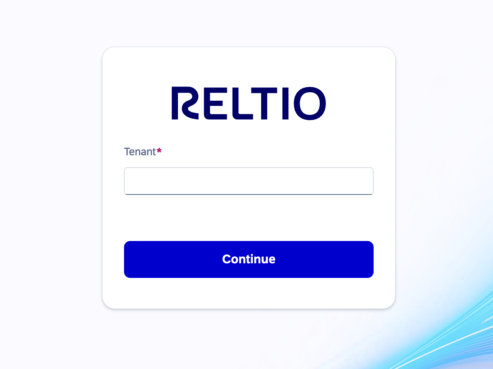
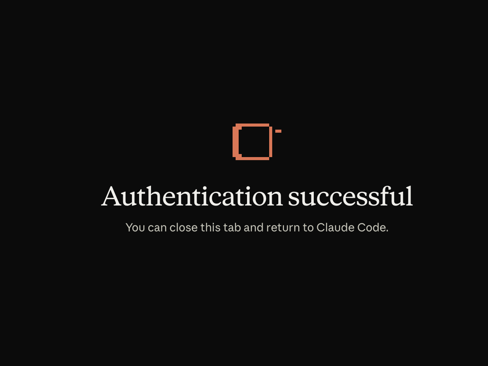

# Reltio MCP Server: Getting Started

A walkthrough of connecting to Reltio's MCP (Model Context Protocol) server from
Claude Code, exploring the tools it exposes, and running a hands-on test of
Reltio's entity matching engine.

> **Note on privacy:** All tenant IDs, entity IDs, and personal identifiers in
> this document have been replaced with placeholders (e.g. `<CUSTOMER_TENANT_ID>`).
> Substitute your own environment's real values when following along.

## What is the Reltio MCP Server?

It exposes Reltio Platform REST APIs (entities, relationships, matching,
merge/unmerge, data model config, workflow tasks, segments, data loader, etc.)
as tools an AI assistant can call directly, instead of hand-building Postman
requests.

## 1. Authenticate

```
claude mcp login reltio-mcp-server
```

This opens a browser-based login screen. Sign in and enter your tenant ID
when prompted. On success you'll see:

```
Authentication successful. You can close this tab and return to Claude Code.
```

Restart Claude Code afterward so the session picks up the authenticated
connection.





### Common issue: "Which endpoint/URL do I authenticate against?"

A third-party engineer working through this same setup got stuck here: the
login step needs to know which Reltio MCP endpoint to talk to, and it isn't
obvious where that value comes from. Reltio's official documentation confirms
this is something you must already have in hand, not something the client
derives automatically. Direct quote from Reltio's docs:

> "Before you begin, make sure you have: ... The AgentFlow MCP server
> endpoint ... Contact Reltio Support if you need help enabling the MCP
> feature"
>
> Source: [Configure Claude to connect with Reltio AgentFlow MCP Server](https://docs.reltio.com/en/developer-resources/ai-integrations/reltio-model-context-protocol-mcp-server-at-a-glance/configure-claude-to-connect-with-reltio-agentflow-mcp-server), Prerequisites

That same page's official configuration examples show the endpoint as a
placeholder you must fill in yourself with your own environment value; it is
**not** a fixed, universal URL:

```json
"args": [
  "mcp-remote",
  "https://<Env>.reltio.com/ai/tools/mcp/",
  "9696",
  "--debug"
]
```
Source: [Configure Claude to connect with Reltio AgentFlow MCP Server](https://docs.reltio.com/en/developer-resources/ai-integrations/reltio-model-context-protocol-mcp-server-at-a-glance/configure-claude-to-connect-with-reltio-agentflow-mcp-server), Mac/Linux and Windows configuration examples

`<Env>` is tenant/environment-specific. If you don't already know it, ask your
Reltio tenant administrator or Reltio Support; the docs don't provide a
self-service way to look it up.

Once the client has the correct endpoint, sign-in itself is handled for you
via OAuth. Per Reltio's documentation:

> "The AgentFlow MCP Server uses OAuth 2.0 Authorization Code Flow with PKCE
> to authenticate users and agents. This flow ensures secure, auditable, and
> context-aware access to Reltio APIs. All interactions with MCP tools
> require a valid access token issued by the Reltio Authentication Server."
>
> "MCP tool access attempt (without token): The MCP client tries to invoke
> the MCP tool by calling the AgentFlow MCP Server. Since no token is
> provided, it receives a 401 Unauthorized response with a
> WWW-Authenticate header pointing to the OAuth discovery endpoint."
>
> Source: [Authentication flow for the AgentFlow MCP Server](https://docs.reltio.com/en/developer-resources/ai-integrations/reltio-model-context-protocol-mcp-server-at-a-glance/authentication-flow-for-the-agentflow-mcp-server)

## 2. Verify the connection

Ask Claude to run a health check; under the hood this calls the server's
`health_check_tool`:

```
status: ok
message: MCP server is running
```

## 3. See what the server can do

The `capabilities_tool` lists every available tool (entity CRUD, matching,
relationships, config/metadata, workflow tasks, segments, data loader, etc.)
along with example usages for each.

## 4. Identify your tenant(s)

Reltio distinguishes between:

- **Customer tenant**: the tenant ID you authenticated with.
- **Data tenant**: the underlying tenant(s) your customer tenant subscribes
  to via DTSS (Distributed Tenant Sharing Service).

```
list_data_tenants_tool(tenant_id=<CUSTOMER_TENANT_ID>)
```

returns the data tenant ID(s) available to you. Most tools only need the
customer `tenant_id`; only tools with `_on_data_tenant` in the name need the
data tenant ID separately.

## 5. Explore the tenant's data model

Before creating or searching data, it helps to understand the schema:

```
get_tenant_metadata_tool(tenant_id=<CUSTOMER_TENANT_ID>)
get_data_model_definition_tool(object_type=["entityTypes"], tenant_id=<CUSTOMER_TENANT_ID>)
get_entity_type_definition_tool(entity_type="Individual", tenant_id=<CUSTOMER_TENANT_ID>)
get_match_rules_tool(entity_type="Individual", tenant_id=<CUSTOMER_TENANT_ID>)
```

This tenant used Reltio's B2B Velocity Pack, with entity types including
`Individual`, `Organization`, `Location`, `Household`, `Product`, and others.
The `Individual` type's `Address` attribute is a **Reference** to a `Location`
entity (linked via the `IndividualHasAddress` relationship type), while
`Phone` is a **Nested** attribute with sub-fields like `Number`, `Type`, and
`FormattedNumber`.

Reviewing the match rules ahead of time matters: it tells you exactly which
field combinations Reltio's matching engine considers when flagging
duplicates. For example, this tenant had:

- **BaseRule06**: exact `Phone.Number` + fuzzy (phonetic) `FirstName`/`LastName`
- **BaseRule03**: exact `Address.AddressLine1` + `Address.PostalCode.Zip5` + fuzzy names
- **BaseRule01/02**: automatic (auto-merge) rules requiring *exact* name matches, stricter than the two above

## 6. Create test data to exercise entity matching

**Goal:** create a few similar-looking `Individual` (Person) records and see
whether Reltio's built-in matching engine flags them as potential duplicates.

**Step A: create a shared address (`Location` entity):**

```
create_entity_tool(
  tenant_id=<CUSTOMER_TENANT_ID>,
  entities=[{
    "type": "configuration/entityTypes/Location",
    "attributes": {
      "AddressLine1": [{"value": "123 Main St"}],
      "City": [{"value": "San Francisco"}],
      "StateProvince": [{"value": "CA"}],
      "PostalCode": [{"value": {"Zip5": [{"value": "94105"}]}}],
      "Country": [{"value": "US"}]
    }
  }]
)
```

Reltio auto-cleansed/enriched this on write, adding a ZIP+4, geocode
coordinates, and a verification status, without any extra input from us.

**Step B: create three `Individual` records with phonetically similar names
and the *same* phone number:**

| Record | First Name | Last Name | Phone |
|---|---|---|---|
| 1 | Jon | Smith | 415-555-1234 |
| 2 | John | Smith | 415-555-1234 (same) |
| 3 | Jonathan | Smyth | 415-555-1234 (same) |

```
create_entity_tool(
  tenant_id=<CUSTOMER_TENANT_ID>,
  return_objects=true,
  entities=[
    {"type": "configuration/entityTypes/Individual", "attributes": {
      "FirstName": [{"value": "Jon"}], "LastName": [{"value": "Smith"}],
      "Phone": [{"value": {"Type": [{"value": "Mobile"}], "Number": [{"value": "4155551234"}]}}]
    }},
    {"type": "configuration/entityTypes/Individual", "attributes": {
      "FirstName": [{"value": "John"}], "LastName": [{"value": "Smith"}],
      "Phone": [{"value": {"Type": [{"value": "Mobile"}], "Number": [{"value": "4155551234"}]}}]
    }},
    {"type": "configuration/entityTypes/Individual", "attributes": {
      "FirstName": [{"value": "Jonathan"}], "LastName": [{"value": "Smyth"}],
      "Phone": [{"value": {"Type": [{"value": "Mobile"}], "Number": [{"value": "4155551234"}]}}]
    }}
  ]
)
```

**Step C: link each `Individual` to the shared `Location` via the
`IndividualHasAddress` relationship:**

```
create_relationships_tool(
  tenant_id=<CUSTOMER_TENANT_ID>,
  relations=[
    {
      "type": "configuration/relationTypes/IndividualHasAddress",
      "startObject": {"type": "configuration/entityTypes/Individual", "objectURI": "entities/<INDIVIDUAL_ID>"},
      "endObject": {"type": "configuration/entityTypes/Location", "objectURI": "entities/<LOCATION_ID>"},
      "attributes": {"AddressType": [{"value": "Home"}], "Primary": [{"value": true}]}
    }
    // ...repeated for each of the 3 individuals
  ]
)
```

## 7. Check for potential matches

```
get_entity_with_matches_tool(
  entity_id=<INDIVIDUAL_ID>,
  tenant_id=<CUSTOMER_TENANT_ID>,
  match_attributes=["FirstName", "LastName", "Phone", "Address"],
  match_limit=10
)
```

### Result

The first record ("Jon Smith") came back with **2 potential matches**: the
"John Smith" and "Jonathan Smyth" records, each flagged by **two** match
rules simultaneously:

| Matched record | Rule fired | Why |
|---|---|---|
| John Smith | `BaseRule06` | Exact phone number + phonetically similar first name ("Jon" ≈ "John") |
| John Smith | `BaseRule03` | Exact address line + ZIP5 + phonetically similar name |
| Jonathan Smyth | `BaseRule06` | Exact phone number + phonetically similar name |
| Jonathan Smyth | `BaseRule03` | Exact address + phonetically similar name |

## What this demonstrated

- **Suspect vs. automatic rules matter**: the stricter *automatic* rules
  (which require exact name matches) did **not** fire, since our names only
  phonetically resembled each other. Only the *suspect* rules, designed for
  fuzzy matches, triggered, which is correct: these get queued for human
  review rather than auto-merged.
- **Multiple independent signals compound confidence**: each pair matched on
  *two* separate rules (one phone-based, one address-based) rather than just
  one, which is a stronger duplicate signal than either alone.
- Reltio's cleansing pipeline runs automatically on write (address
  geocoding/verification, phone formatting/validation); no separate
  cleansing step was needed.

## Next steps to explore

- `verify_match_tool(entity_id_1, entity_id_2, tenant_id)`: get a
  human-readable explanation of why two entities matched.
- `merge_entities_tool(entity_ids, tenant_id)`: merge a matched pair, then
  `unmerge_entity_tool(...)` to reverse it.
- `reject_entity_match_tool(source_id, target_id, tenant_id)`: mark a pair as
  *not* a duplicate and confirm it no longer appears as a potential match.

## Related guides

- [Connecting Microsoft Copilot to the Reltio MCP Server](copilot/README.md): the
  same MCP endpoint, connected from Microsoft Copilot Studio instead of
  Claude Code.
- [Live Reconnect Test: Claude Code vs. Copilot Studio](claude/README.md): a
  side-by-side test that isolates why Copilot Studio fails where Claude Code
  succeeds on the same environment.
