# Connecting Microsoft Copilot to the Reltio MCP Server

Steps to connect a Microsoft Copilot Studio agent to the Reltio AgentFlow MCP
server, based on Reltio's official documentation, with screenshots captured
while performing the integration.

> **Note on privacy:** As with the main guide, tenant/environment values and
> personal identifiers here are replaced with placeholders (e.g. `<environment>`).

## Prerequisites

Per Reltio's official documentation:

> "You must have access to Microsoft Copilot Studio or Microsoft 365 Copilot
> Agent Builder.
> Your organization has an eligible Microsoft 365 subscription with Copilot
> enabled.
> You are signed in using a Microsoft ID.
> You have permission to create and manage agents in the Copilot
> environment, or administrator approval if agent creation is restricted.
> An administrator has enabled Copilot features in your Microsoft 365
> tenant.
> You have access to a Reltio environment that exposes its MCP server
> endpoint."
>
> Source: [Create a Microsoft Copilot agent to run Reltio MCP tools](https://docs.reltio.com/en/developer-resources/ai-integrations/reltio-model-context-protocol-mcp-server-at-a-glance/create-a-microsoft-copilot-agent-to-run-reltio-mcp-tools), Prerequisites

The same "which endpoint do I use" issue from the main guide applies here too;
see [../README.md](../README.md#common-issue-which-endpointurl-do-i-authenticate-against)
for that background.

## Steps

The steps below are Reltio's official procedure, quoted directly, with a
screenshot placeholder under each one to fill in as the integration is
performed.

1. Go to Microsoft Copilot Studio (`copilotstudio.microsoft.com`) and sign in
   using your Microsoft ID account.

2. Select **+ New agent**.

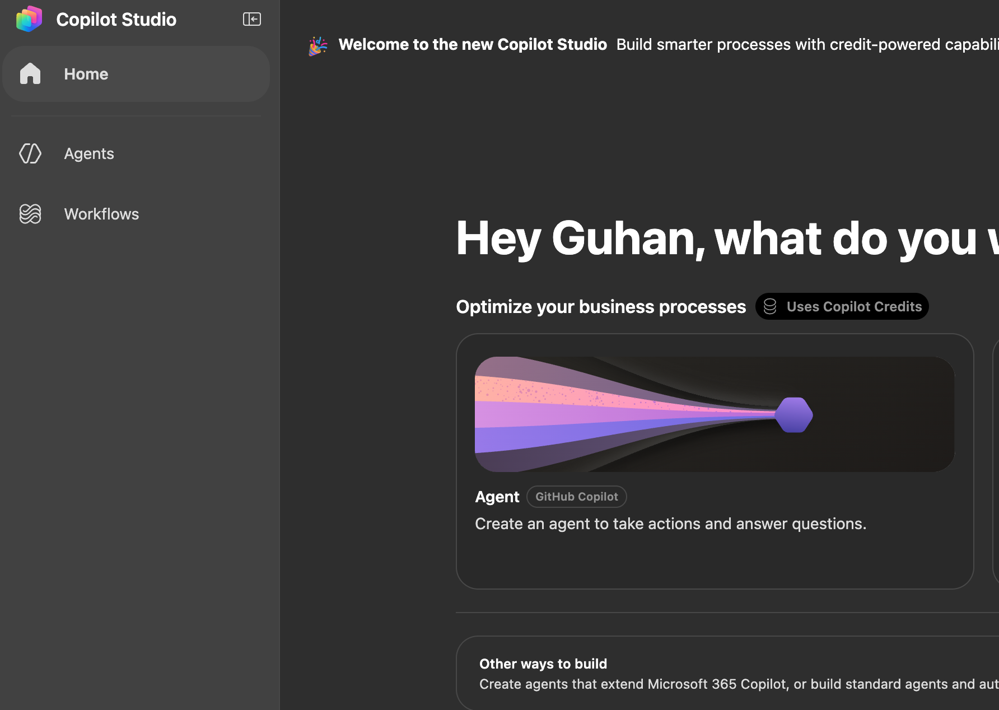

3. On the **Start building your agent** page, select the **Configure** tab.

4. Configure the agent details:
   - In the **Name** field, enter a name for your agent (for example,
     `Reltio Data Explorer`).
   - In the **Description** field, enter a description for the agent.
   - In the **Instructions** field, define the agent's behavior and scope.

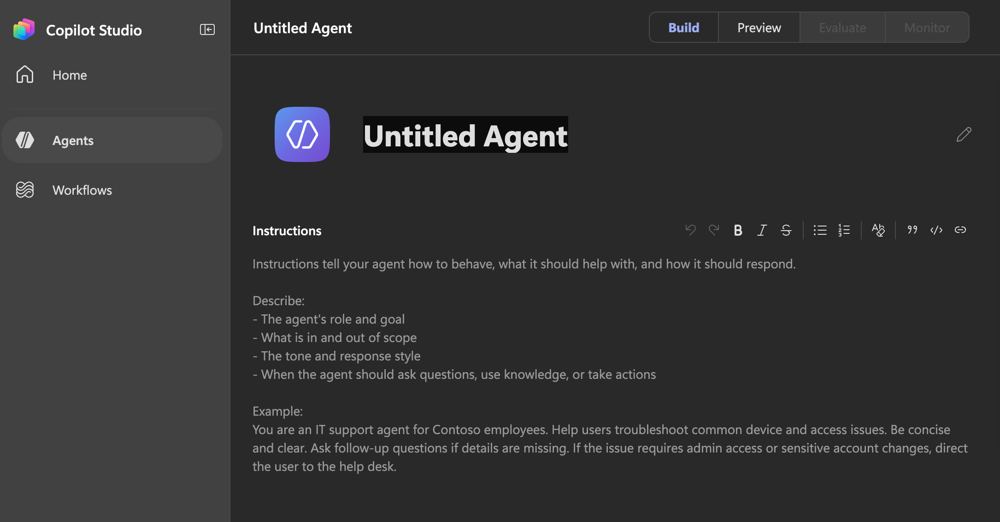

5. Select **Create** to provision the agent.

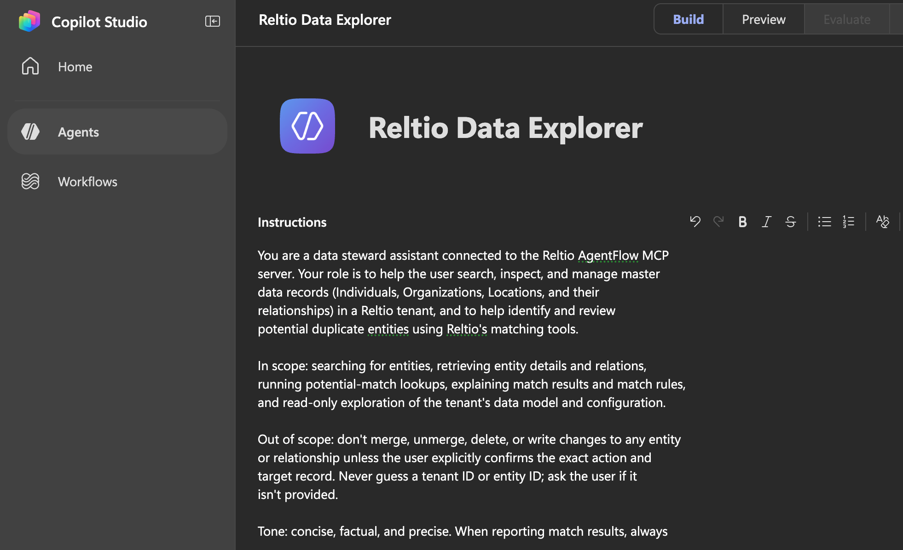

6. Select the **Tools** tab, and then select **Add tool**.

> **UI discrepancy observed:** Reltio's documentation says to "select the
> Tools tab," but the actual Copilot Studio agent page (at time of writing)
> shows **Tools** as a section in a right-hand configuration panel (alongside
> Model, Skills, Knowledge, Connected agents, and Memory), not a separate top
> level tab. Select the **`+`** next to **Tools** in that panel instead.

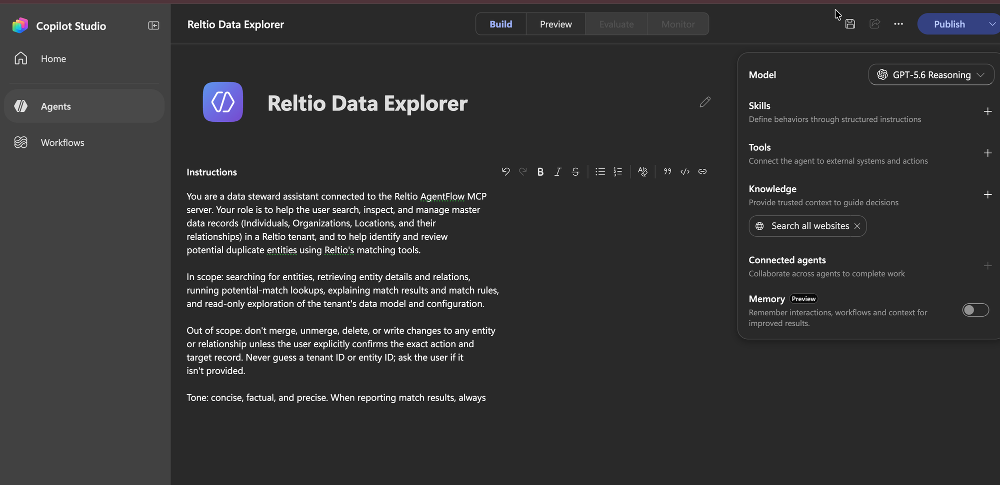

7. In the **Add a tool** dialog, select **Model Context Protocol**.

> **UI detail observed:** the actual **Add a tool** dialog (at time of
> writing) doesn't list "Model Context Protocol" under its **Featured** tab.
> There's a dedicated **MCP** tab alongside Featured, Connectors, and
> Workflows, but the direct path is the **`+ Add`** button in the top right
> corner: it opens a small dropdown with two options, **"Model Context
> Protocol (MCP)"** and **"Workflow."** Select **Model Context Protocol
> (MCP)**.

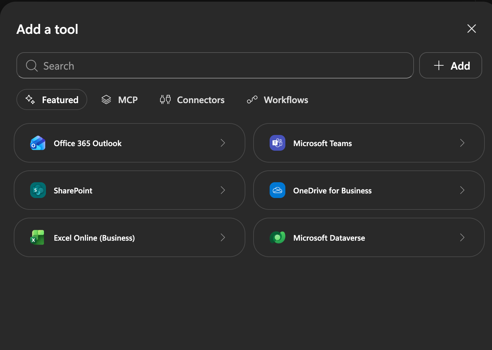

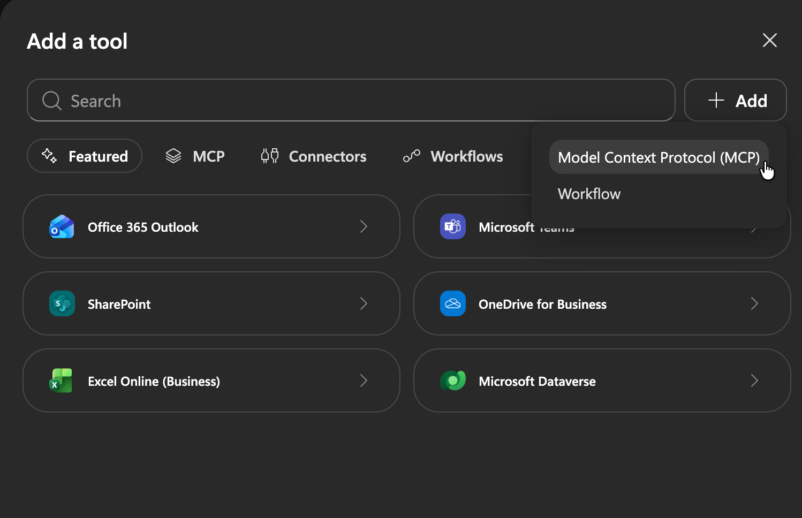

8. Configure the MCP server connection:

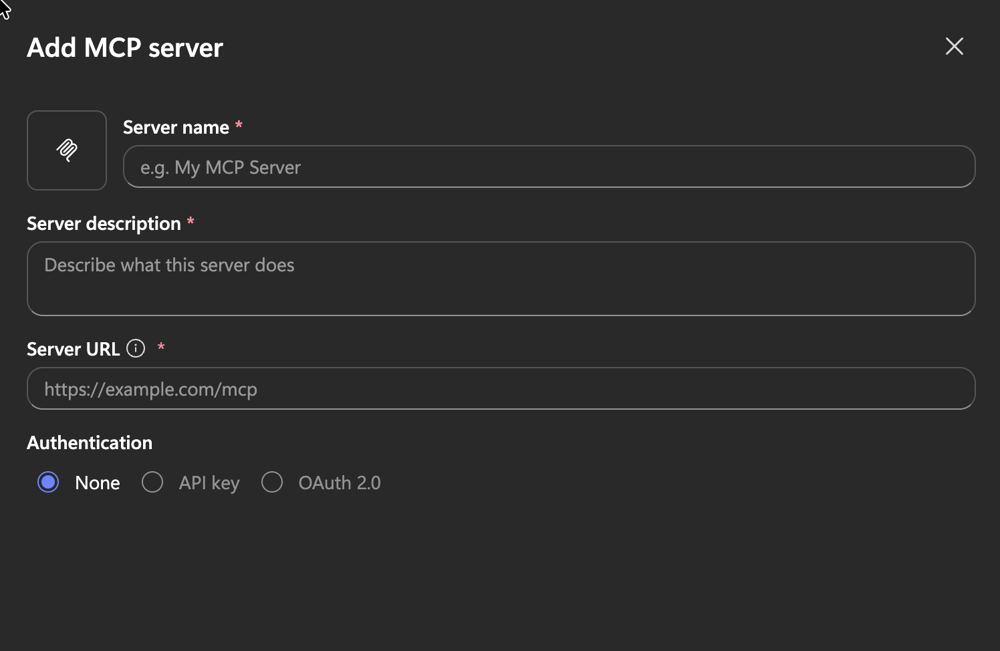

   - Enter a server name and description.
   - In the **Server URL** field, enter the Reltio MCP server endpoint:

     ```
     https://<environment>.reltio.com/ai/tools/mcp/
     ```

     Replace `<environment>` with your tenant domain.
   - Select **OAuth 2.0** as the authentication method and provide the
     required credentials (Client ID, Client Secret, Authorization URL,
     Token URL, and scopes).

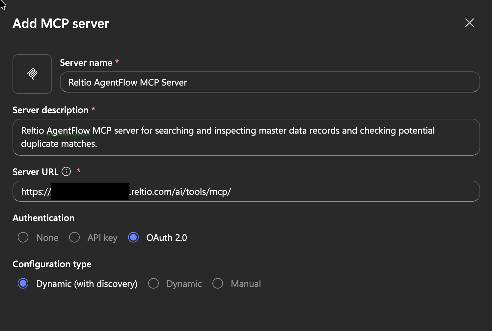

> **UI detail observed:** selecting **OAuth 2.0** reveals an additional
> **Configuration type** choice not mentioned in Reltio's docs: **Dynamic
> (with discovery)**, **Dynamic**, or **Manual**. "Dynamic (with discovery)"
> is selected by default, which matches the OAuth discovery flow described
> in [Authentication flow for the AgentFlow MCP Server](https://docs.reltio.com/en/developer-resources/ai-integrations/reltio-model-context-protocol-mcp-server-at-a-glance/authentication-flow-for-the-agentflow-mcp-server)
> (the client discovers the OAuth endpoints itself rather than them being
> entered manually), so it was left as-is.
>
> **Note on privacy:** the tenant ID in the Server URL field is redacted
> (black bar) in the screenshot above.

### Troubleshooting: "Can't create MCP server. Try again."

Clicking **Add** with the Server URL above failed with a red banner reading
"Can't create MCP server. Try again."

**Cause:** `<environment>` in the URL pattern is **not** the customer tenant
ID. It's a separate Reltio environment/pod name. Using the tenant ID there
(e.g. `https://<CUSTOMER_TENANT_ID>.reltio.com/ai/tools/mcp/`) produces a
hostname that doesn't resolve at all (confirmed via DNS lookup: `curl` failed
with "Could not resolve host").

**How the correct value was found:** the same MCP server was already
connected and working from Claude Code (see the main guide). Checking that
existing connection's configuration (`claude mcp get reltio-mcp-server`)
showed the actual URL in use, which uses the environment name instead of the
tenant ID. That corrected hostname resolves and returns a normal
`401 Unauthorized` (the expected response for an unauthenticated request,
per Reltio's documented flow) rather than a DNS failure.

**Fix:** use your Reltio environment/pod name in place of `<environment>`,
not your tenant ID. If you don't already have a working MCP connection to
cross-check against, ask your Reltio admin or Reltio Support for the correct
environment value, per the same guidance in the
[main guide's endpoint section](../README.md#common-issue-which-endpointurl-do-i-authenticate-against).

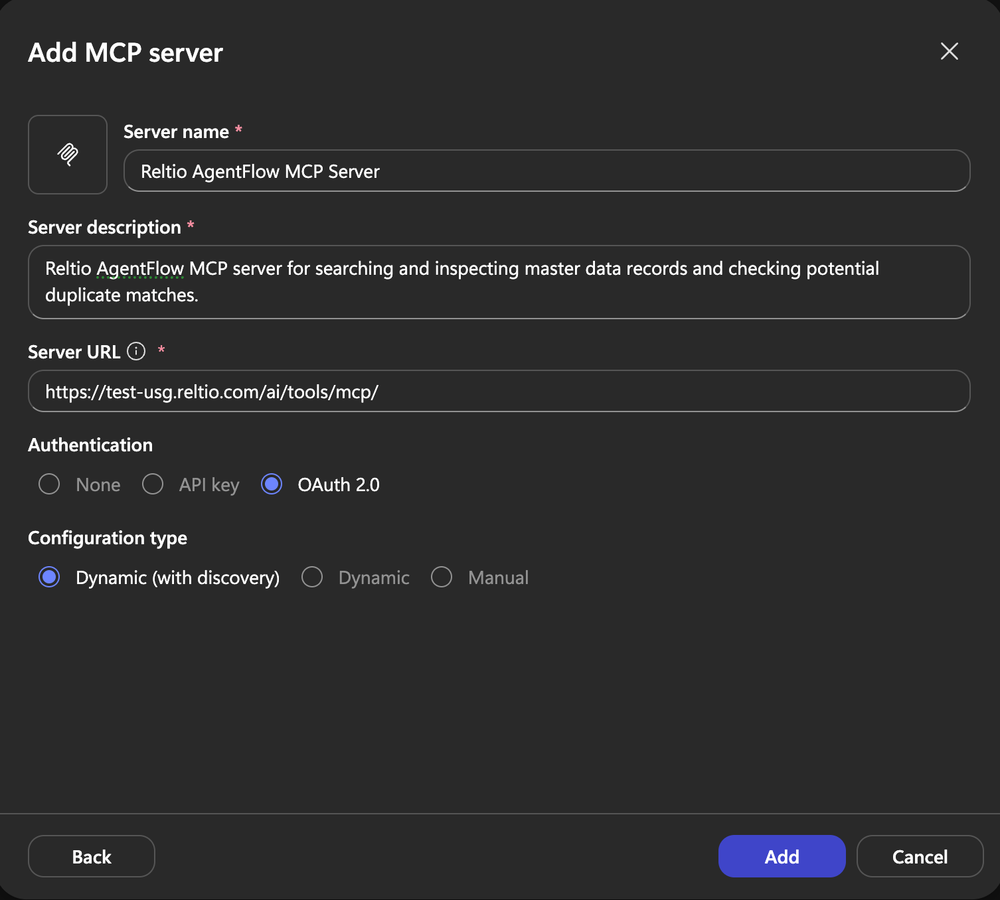

9. Select **Create**, and then select **Connect** to establish the
   connection.

10. When the connection succeeds, verify that the MCP tools appear in the
    **Tools** tab.

> **Note:** Copilot Studio doesn't support renewing an expired tool
> connection. When the connection expires, create a new connection using the
> same tool in Connection Manager. You can have multiple connections for the
> same agent tool.

11. Select **Test** and run a sample query to validate that the agent can use
    the MCP tools.

Source: [Create a Microsoft Copilot agent to run Reltio MCP tools](https://docs.reltio.com/en/developer-resources/ai-integrations/reltio-model-context-protocol-mcp-server-at-a-glance/create-a-microsoft-copilot-agent-to-run-reltio-mcp-tools)

## Result

Once connected, the Copilot agent can discover and run Reltio MCP tools to
read and act on data in the Reltio environment, the same tools used from
Claude Code in the main guide.

## Root cause found, and engineering's response

After the steps above kept failing, further investigation (see
[../claude/README.md](../claude/README.md) for the live reconnect test that
isolated it) found two distinct issues in the AgentFlow OAuth
implementation:

1. `/.well-known/oauth-protected-resource` incorrectly required
   authentication (should be publicly fetchable per the MCP Authorization
   spec).
2. The OAuth server only accepted `localhost`-style redirect URIs, which
   blocks any cloud-hosted client (Copilot Studio included) that must use a
   fixed external HTTPS callback.

Reltio's engineering team responded with clarification on both:

1. `/.well-known/oauth-authorization-server` is the metadata endpoint they
   intend clients to use (confirmed working throughout this investigation);
   `oauth-protected-resource` was never added to their auth-bypass list
   since it isn't part of their intended flow. (One residual inconsistency:
   the MCP endpoint's `401` response still advertises
   `oauth-protected-resource` via its `WWW-Authenticate` header, which could
   still trip up a client that trusts that header literally.)
2. Redirect URIs are managed separately on their login page (not via the
   customer client management API's `redirectUri` field, which is
   deprecated). Redirect URIs for Copilot Studio, Claude, and ChatGPT have
   been added there and were reported as tested.

This second point also exposed a gap in our own earlier testing: our
`redirectUrlNotAllowed` reproduction used a placeholder redirect URI
(`https://example.com/callback`), not Copilot Studio's actual one, so it
didn't actually prove Copilot Studio's real callback was blocked, only that
an arbitrary one was. The retest below re-attempts the connection now that
the redirect URI fix is reported to be in place.

## Retest: after engineering feedback

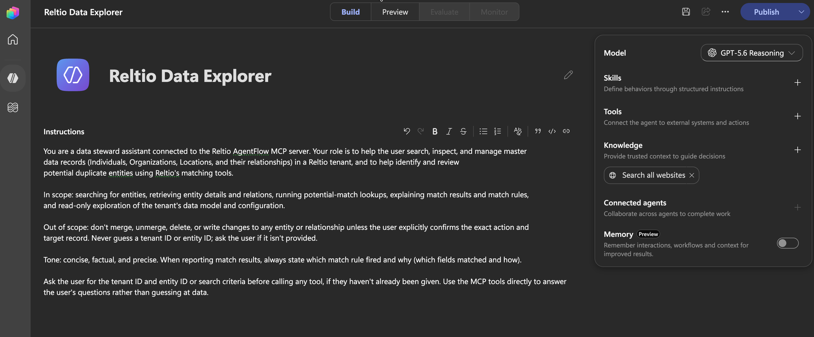

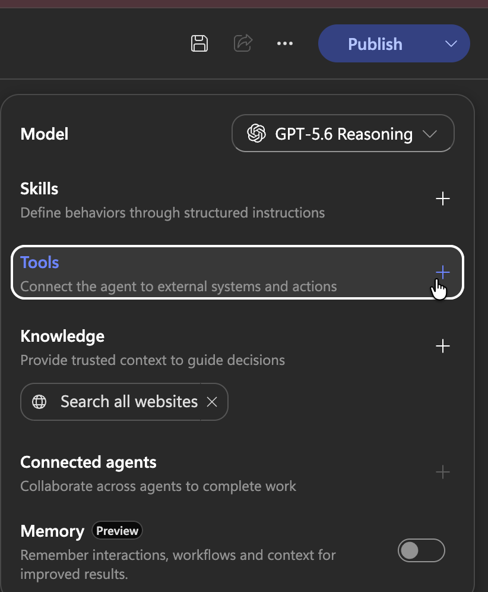

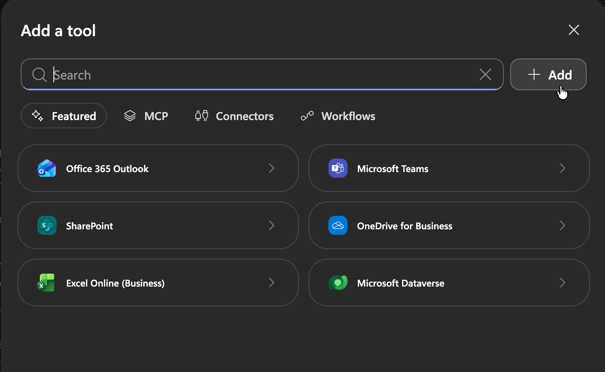

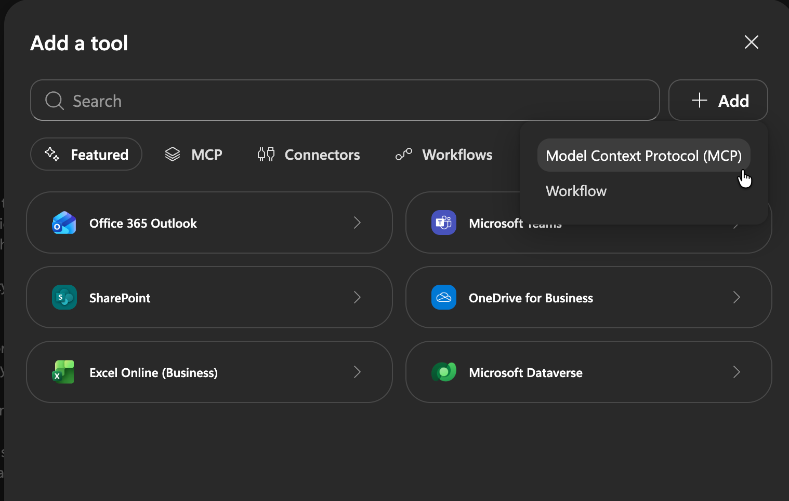

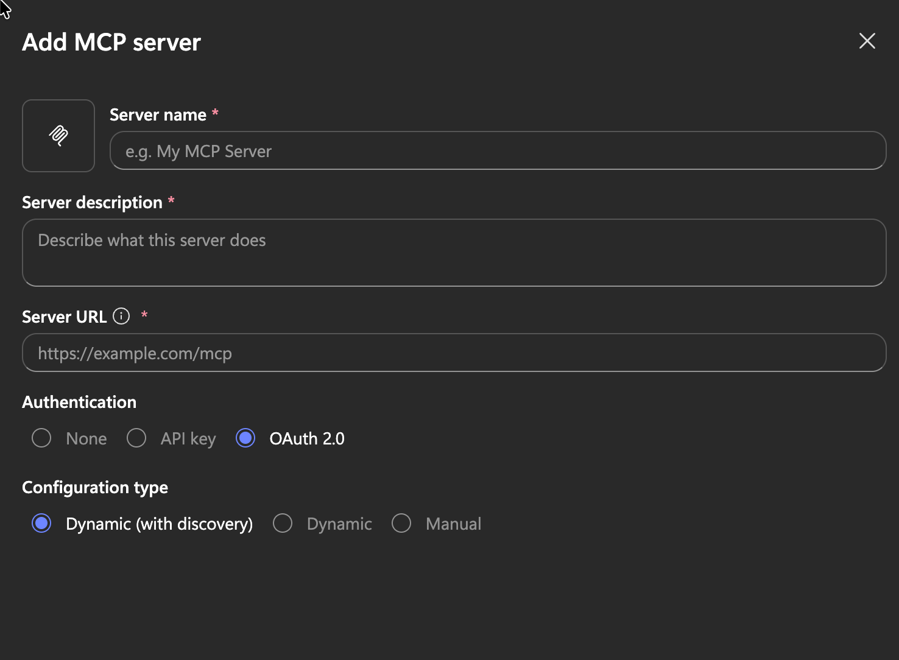

For this blank form:

- **Server name**: `Reltio AgentFlow MCP Server`
- **Server description**: `Reltio AgentFlow MCP server for searching and inspecting master data records and checking potential duplicate matches.`
- **Server URL**: `https://<environment>.reltio.com/ai/tools/mcp/` (the
  environment/pod name, not the tenant ID, see the troubleshooting note
  above)
- **Authentication**: `OAuth 2.0`
- **Configuration type**: select **Dynamic** (not **Dynamic (with
  discovery)**). Engineering's fix addresses the redirect URI allowlist, not
  the still-unresolved `oauth-protected-resource` discovery bug, so "Dynamic
  (with discovery)" is still expected to fail for that separate reason.
  "Dynamic" only needs Authorization URL (`https://login.reltio.com`) and
  Token URL (`https://login.reltio.com/token`), both already confirmed
  valid, without depending on the broken discovery endpoint.

### Result: still failing

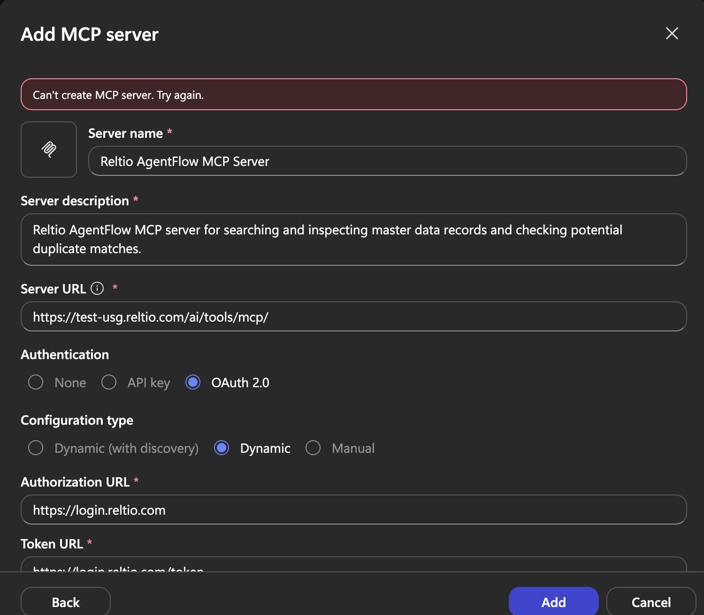

With the form filled in exactly as above (Dynamic configuration type,
correct Server URL, both Authorization/Token URLs confirmed valid), the
same **"Can't create MCP server. Try again."** error still appears.

### What the browser network capture showed

Capturing the network traffic (DevTools → Network, with "Preserve log" on)
while clicking **Add** showed that the failing request never goes to
Reltio from the browser. It's Copilot Studio's own backend call:

```
POST https://<region>.gateway.prod.island.powerapps.com/api/botmanagement/v1/environments/<environment-id>/connectors/apim
→ 409 Conflict
{
  "Code": "DuplicateItemError",
  "Message": "A custom connector with display name '<name>' already exists in the environment. It may have been created by another user or may not be visible to you. Please specify a different name."
}
```

Findings from repeated attempts:

- The same 409 appears for **brand-new names** that were never used before.
- It happens with all three configuration types. The request payload
  shows `identityProvider: "oauth2pkcewithdcr"` in the Dynamic modes and
  `identityProvider: "oauth2pkce"` in Manual mode, so it fails even when
  no dynamic client registration is involved.
- It reproduces on two different agents and in both Chrome and Safari,
  which rules out anything browser-side or agent-specific.
- Each failing call takes **about 12 seconds** before returning the 409.
  A genuine duplicate-name check would return in milliseconds.
- The classic **Custom connectors** list in Power Apps
  (`make.powerapps.com/.../customconnectors`) shows no Reltio connectors
  at all, so there's nothing visible to clean up.
- `https://login.reltio.com/.well-known/oauth-authorization-server` and
  `/.well-known/openid-configuration` both return 404. The metadata lives
  under `https://<environment>.reltio.com/ai/tools/.well-known/oauth-authorization-server`
  instead. This doesn't explain the Manual-mode failure, but it matters
  for any client that tries to discover metadata from the Authorization
  URL's host.

**Current read:** the 12-second delay plus a "duplicate" error on
never-used names suggests Copilot Studio's backend creates the connector,
fails at a later step, retries, and collides with the connector it just
created. If so, the real error is hidden server-side and isn't visible
from the browser.

### Control test: a non-Reltio MCP server

To separate Reltio from the environment, the same **Add MCP server** flow
was run with Microsoft's own public MCP server, with no authentication at
all:

| Server URL | Authentication | Result |
|---|---|---|
| `https://learn.microsoft.com/api/mcp` | None | 409 DuplicateItemError |
| `https://learn.microsoft.com/api/mcp` (second, new name) | None | 409 DuplicateItemError, ~12 s |

### Conclusion

The "Can't create MCP server" failure in this environment has nothing to
do with Reltio. It happens with Microsoft's own MCP server, with no OAuth,
no redirect URIs, and no Reltio endpoint involved. The problem is with
Copilot Studio's MCP tool creation in this specific Power Platform
environment, most likely an environment policy or configuration issue.
It needs to go to the Power Platform environment admin or Microsoft
support, with the request correlation IDs from the network capture.

The Reltio-side observations earlier in this guide are still accurate as
observations, but they are **not** what blocks Copilot Studio here:

- `/.well-known/oauth-protected-resource` returns 401 by design; clients
  are meant to use `/.well-known/oauth-authorization-server`.
- Redirect URIs for Copilot Studio are managed on Reltio's login page
  allowlist, not through the client management API.

To confirm the Reltio integration end to end, the next step is to repeat
this setup in a Copilot Studio environment where adding MCP servers works
(verified first with the Microsoft Learn control test above).

## Screenshots

Screenshots are captured inline above, next to the step they correspond to,
as the integration is performed.
